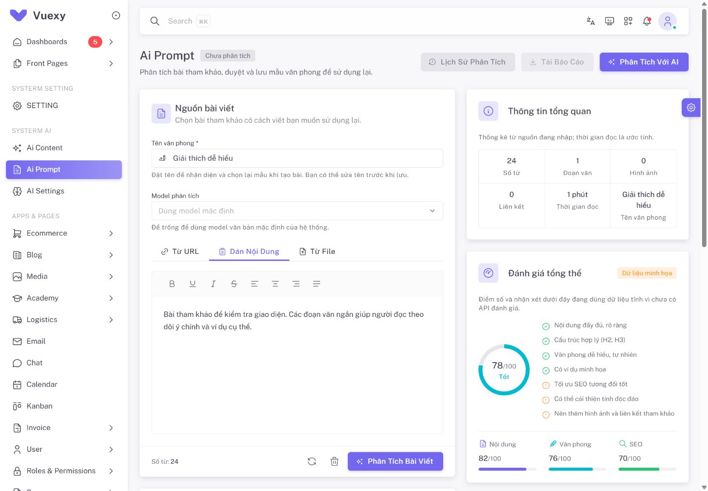

# QA nối API Ai Prompt — 2026-10-04

Phạm vi: giao diện `/admin/ai/prompt`, dùng API hiện có để phân tích bài tham khảo và duyệt/lưu/sửa mẫu văn phong hiện tại. Danh sách quản lý tất cả văn phong để sau. Lịch sử phân tích, điểm chất lượng, phần trăm văn phong, SEO, ảnh và tính độc đáo chưa có API tương ứng nên giữ dữ liệu minh họa có nhãn.

## Kiểm thử tự động

| Kiểm chứng | Kết quả |
| --- | --- |
| Toàn bộ frontend, `npm run test:run` | **38 file / 238 test đạt** |
| Ai Prompt: service, composable và UI | **3 file / 32 test đạt**, nằm trong tổng 238 |
| ESLint scoped page/components/composables/service/utils và ba file test | **Đạt** |
| Production build, `npm run build` | **Đạt**, 31,40 giây |

Test tích hợp dùng page/composable/service thật với HTTP được giả lập: catalog → nhập nguồn/tên → POST analysis → GET ready → sửa quy tắc/hướng dẫn → người dùng POST lưu → PUT version → PUT Settings partial. Các ca còn lại kiểm validation, giữ ranh giới đoạn khi chuyển HTML thành text, nguồn snapshot, polling tuần tự, abort/cancel, resume theo actor, hết hạn, form độc lập với kết quả, evidence, xung đột 409 và default lỗi riêng.

Các ca mất phản hồi/reload xác nhận client không tự replay POST. Cờ pending chặn gửi lại; GET recovery chỉ chấp nhận duy nhất profile đúng tên và analysis ID, giữ bản đang sửa. Kết quả nhiều trang/không tìm thấy/nhiều mẫu tiếp tục khóa. Mở UUID khác phải xác nhận bỏ form chưa lưu trước GET.

Các warning resolve component trong test cũ do stub; production build còn warning asset `section-title-icon.png` có sẵn. Không có lỗi build. Không gọi model trả phí hoặc lưu profile thử vào database trong đợt QA này.

## Kiểm tra trình duyệt thật

Localhost `http://127.0.0.1:8000/admin/ai/prompt`, phiên admin đã đăng nhập:

- Mở trang tải catalog backend; select chỉ hiện model text khả dụng và lựa chọn dùng mặc định.
- Gửi form rỗng hiển thị lỗi tên và nguồn trước POST; chưa tạo analysis.
- Nhập tên “Giải thích dễ hiểu” và bài thử: editor hiển thị đúng, thống kê **24 từ / 1 đoạn**, tên xuất hiện ở khối thống kê.
- Tab URL/file có input và thao tác đọc; chưa có nguồn thì nút đọc/phân tích tương ứng khóa. Chưa gọi preview mạng hoặc upload file thật qua browser.
- Modal lịch sử ghi rõ dữ liệu minh họa; có ô UUID để GET kết quả thật, UUID chưa hợp lệ khóa nút mở.
- Chưa có kết quả `ready` thì tải báo cáo khóa; các số điểm và nhận xét mẫu có nhãn minh họa.
- Desktop **1440 × 1000** hiển thị hai cột; mobile **390 × 844** xếp một cột, tabs cuộn. Sau layout ổn định, `scrollWidth` không vượt `innerWidth`; viewport tạm được reset sau kiểm tra.
- Không ghi nhận console error mới. Các cảnh báo i18n thiếu key menu thuộc project hiện có.

Ảnh là trạng thái nhập nguồn trước khi chạy AI, không phải bằng chứng model đã phân tích thành công:

## Giới hạn nghiệm thu

Browser QA xác nhận hiển thị, catalog và input; luồng queued/ready/lưu/version/default kiểm bằng HTTP giả lập. Chưa thử worker và model thật từ browser hoặc đánh giá chất lượng văn phong. URL/HTML preview giữ yêu cầu `posts.manage`; paste/TXT và WritingProfiles dùng quyền `ai_settings.manage`. GET analysis không trả bài nguồn nên reload chỉ khôi phục trạng thái/kết quả, không khôi phục raw source.

Không có endpoint/migration mới trong đợt này. Bảo vệ POST tại client không thay cho idempotency backend. Contract và phạm vi hiện tại ở [API mẫu văn phong](../api/AI_WRITING_PROFILES_API.md); hạng mục mở rộng ở [PLAN](../plans/PLAN.md#backlog-đang-dùng).
