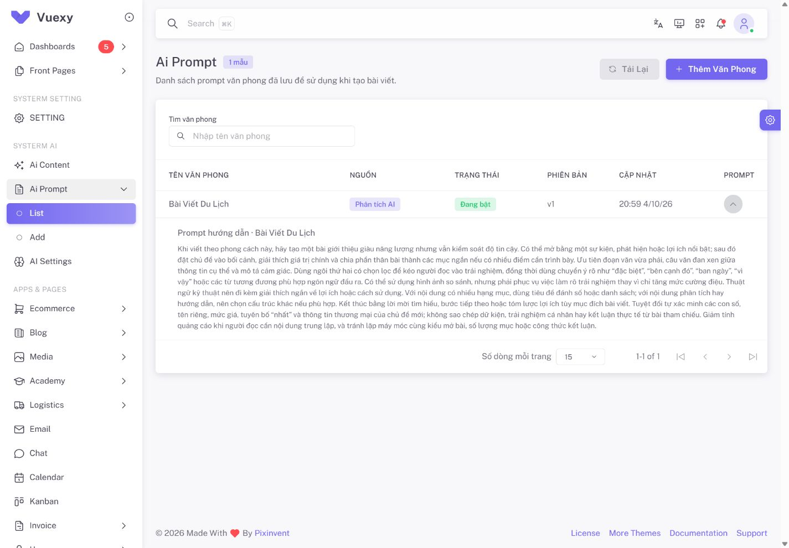

# QA Ai Prompt List/Add — 2026-10-04

Phạm vi yêu cầu: Ai Prompt có List dùng datatable hiển thị prompt văn phong đã lưu và Add dùng trang phân tích hiện tại. Menu dọc/ngang cùng route; URL cũ redirect về List. Dùng backend/API đang có.

## Kiểm thử tự động

| Kiểm chứng | Kết quả |
| --- | --- |
| Toàn bộ frontend, `npm run test:run` | **39 file / 250 tests đạt** |
| Ai Prompt: API / flow / UI Add / list | **5 / 20 / 8 / 11 tests**, tổng **44** trong 250 |
| Scoped ESLint cho route/view/composable/service/navigation/tests thay đổi | **Đạt** |
| Production build cuối, `npm run build` | **Đạt**, 1 phút 4 giây, 2857 modules |
| Sau sửa hiển thị khoảng dòng của footer | **11 tests List đạt**, lint/build cuối đạt |

List dùng composable/service thật với HTTP giả để kiểm tổng server thay vì rows hiện tại, query page/size/search/clear, debounce, request tới muộn cả success/error, abort/cleanup, danh sách thu nhỏ, lỗi và tải lại chủ động. Các ca giao diện dùng **VDataTableServer/VBtn/VChip thật** để kiểm metadata, prompt mở rộng/escape, liên kết Add, tổng/range footer và nút sang trang. Test Add cũ chuyển import sang route Add, giữ coverage nguồn → analysis → ready → duyệt/lưu/version/default và xác nhận form chưa lưu.

Warning component stub ở các test cũ và asset `section-title-icon.png` trong build thuộc project hiện có. Không gọi model hoặc ghi database thật trong tests.

## Kiểm tra trình duyệt localhost

Phiên admin đã đăng nhập tại `http://127.0.0.1:8000`:

- `/admin/ai/prompt` redirect về `/admin/ai/prompt/list`.
- List tải **1 profile thật có sẵn**, “Bài Viết Du Lịch”, nguồn Phân tích AI (`origin=reference`), Đang bật, `v1`, thời điểm cập nhật. Mở dòng hiển thị hướng dẫn văn phong đã lưu.
- Tìm “Du Lịch” trả lại mẫu đó; từ khóa “không có văn phong này 2026” trả 0 mẫu và đúng trạng thái không tìm thấy. Xóa lọc và Tải lại hiển thị mẫu trở lại.
- Chọn 25 dòng mỗi trang hoạt động; footer hiện **1-1 of 1**, không hiển thị placeholder. Database chỉ có 1 mẫu nên Next/Last khóa đúng; sang trang với nhiều mẫu kiểm bằng HTTP giả và footer Vuetify thật.
- Nút Thêm văn phong mở `/admin/ai/prompt/add`; có tên/model/editor, ba tab URL/dán/file, phân tích và báo cáo hiện tại. Nút Danh sách quay về List. Menu Ai Prompt hiển thị List/Add.
- Desktop **1440 × 1000** giữ theme Vuexy, bảng và prompt mở rộng. Mobile **390 × 844** xếp phù hợp; sau layout ổn định, List với prompt mở rộng và Add có `scrollWidth=375 <= innerWidth=390`. Viewport tạm được reset sau QA.
- Không có console error trong đợt kiểm tra. Browser chỉ GET profile/catalog và điều hướng; không chạy analysis mới hoặc tạo/sửa/xóa profile.

Ảnh List là profile thật đã có trong database trước QA:

Ảnh Add là giao diện trước khi chạy phân tích mới:

## Phạm vi còn mở

Chỉnh sửa/xóa mọi mẫu từ List, GET lịch sử analysis và chất lượng model thật chưa thuộc đợt này. Các khối chưa có API ở Add tiếp tục giữ nhãn minh họa. Không bổ sung endpoint/migration hoặc thay hợp đồng backend. Báo cáo công việc tại FIX 1 mục 12.21.
