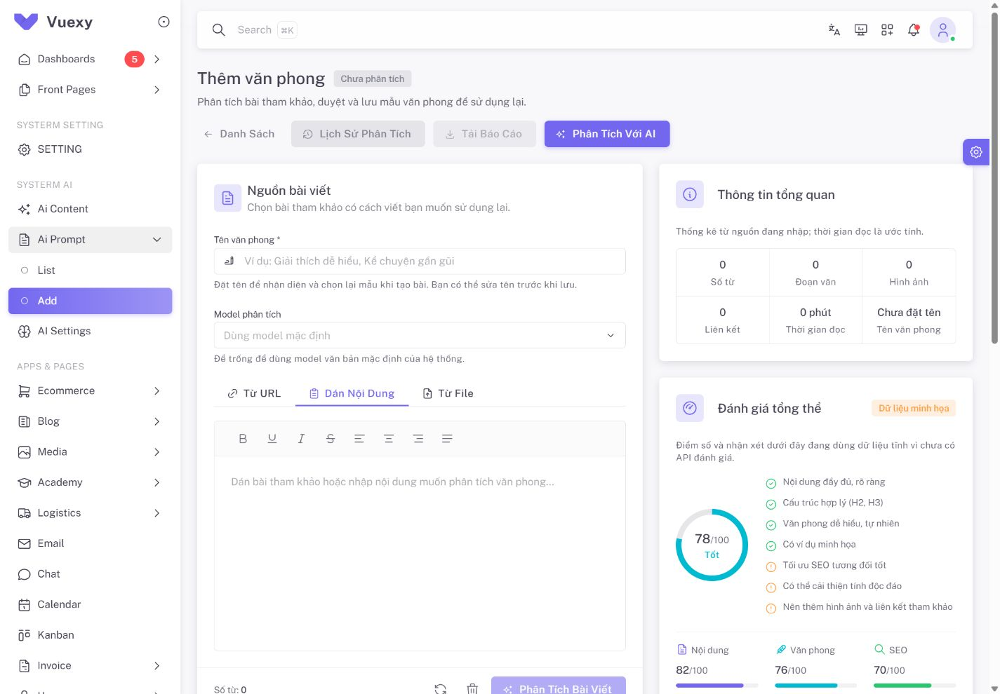

# QA Ai Prompt tạo tiếp văn phong — 2026-10-04

Yêu cầu: Add phải sẵn sàng tạo mẫu tiếp theo sau khi lưu văn phong, đồng thời giải thích mục Quy tắc văn phong và Dẫn chứng. Chỉ sửa frontend/state và tài liệu; dùng API hiện có.

## Nguyên nhân và hành vi sau sửa

Luồng cũ giữ profile vừa lưu để PUT sửa tiếp và nhớ analysis UUID qua reload. Sau khi tách List/Add, chưa có bước reset Add. Vì vậy kết quả, tên/bài mẫu và nút Phân tích lại vẫn ở trên trang.

- Save thành công, kể cả PUT mặc định nếu được yêu cầu, tự dọn tên/nguồn dán/URL/file/model, analysis/result, form duyệt và resume UUID; nút trở về Phân tích với AI. Có snackbar báo đã lưu và có thể tạo văn phong mới.
- Giữ profile/analysis trong database, catalog/cấu hình mặc định và metadata ID profile của analysis cũ để mở lại chủ động.
- Văn phong mới dọn dữ liệu cục bộ; có xác nhận nếu bản duyệt chưa lưu. Không tự POST analysis/profile.
- Save 422/409, lỗi mạng hoặc POST chưa xác định giữ bản đang sửa. POST bất định khóa reset để kiểm tra kết quả trước.
- Profile đã lưu nhưng PUT mặc định thất bại giữ profile và lỗi mặc định riêng; không tự làm trống. Có thể chủ động bấm Văn phong mới.
- GET analysis 403/404/410 dừng resume, mở khóa tạo mới. Lỗi GET mạng của analysis đang chạy vẫn tạm dừng và chờ Kiểm tra lại.

## Kiểm thử tự động

| Kiểm chứng | Kết quả |
| --- | --- |
| Toàn frontend, `npm run test:run` | **39 file / 258 tests đạt** |
| Ai Prompt API / flow / UI Add / list | **5 / 23 / 13 / 11 tests**, tổng **52** |
| Scoped ESLint bốn file application và hai file test thay đổi | **Đạt** |
| Production build cuối, `npm run build` | **Đạt**, 33.19 giây, 2857 modules |

Các ca chính dùng Vue composable/view thật với HTTP fake: nhập → analysis → ready → duyệt → save/default → Add trống → tạo/lưu mẫu thứ hai bằng POST mới, không PUT mẫu trước. Kiểm form/reset/resume, dữ liệu nguồn/model, giữ settings và saved ID lịch sử, response GET tới muộn bị bỏ, reload không GET UUID vừa dọn, save 422/503, lỗi cập nhật mặc định, xác nhận bỏ bản chưa lưu và GET 403/410 không khóa tạo mới. Các ca version/conflict/uncertain-save trước đó tiếp tục đạt.

Warning asset `section-title-icon.png` trong build và warning component stub của test cũ vẫn có trong project. Không chạy model hoặc ghi database thật trong tests.

## Browser localhost

Phiên admin hiện tại tại `http://127.0.0.1:8000/admin/ai/prompt/add`:

- Mở UUID analysis cũ đã có từ dữ liệu profile bằng dialog Lịch sử phân tích; API trả 403 do owner. Đã thấy và sửa lỗi trước đó khiến queued khóa Add. Giữ nguyên kiểm tra quyền backend, không đọc được result của người khác.
- Sau sửa, hiển thị Không có quyền truy cập, Văn phong mới được bật; không có nút Hủy phân tích hoặc polling tự chạy lại.
- Bấm Văn phong mới: tên/editor trống, số từ 0, tab Dán nội dung, model mặc định, Chưa phân tích và nút Phân tích với AI. Reload vẫn trống; sau GET catalog hoàn tất nút/form được bật.
- Screenshot desktop 1440 × 1000; viewport tạm đã reset. Console không ghi nhận error; có warning i18n menu đã có trong project.
- Browser chỉ GET/điều hướng và reset state cục bộ; không chạy model hoặc tạo/sửa/xóa profile. Auto-reset sau lưu và tạo hai mẫu liên tiếp được kiểm bằng HTTP mock, chưa QA bằng browser gọi model trả phí.

## Ý nghĩa quy tắc và dẫn chứng

`rules_json` lưu đặc điểm cách viết để dùng lại. Ví dụ bài mẫu mở bằng “Bạn đã bao giờ thức dậy giữa đại dương?” thì quy tắc có thể là “Mở bài bằng câu hỏi gợi trải nghiệm khi phù hợp”. Các mục bao gồm giọng văn, xưng hô, cảm xúc, mở bài, nhịp câu/đoạn, chuyển ý, từ vựng, thuật ngữ, bố cục, tiêu đề, danh sách, ví dụ, kết bài, cách viết cần tránh và điểm chưa đủ bằng chứng. Người dùng duyệt/sửa quy tắc; không ép bài nào cũng có cùng bố cục.

`evidence_json` lưu đặc điểm được nhận diện, trích đoạn thật và diễn giải lý do. Với câu mẫu trên, feature là opening; excerpt chính là câu hỏi; explanation là tác giả mời người đọc hình dung một trải nghiệm để dẫn vào chủ đề. Backend đối chiếu excerpt với reference, không tự xác nhận tính đúng đắn của diễn giải. UI cho sửa diễn giải/bỏ dẫn chứng và giữ nguyên câu trích.

Khi tạo bài, `ArticlePromptBuilder` chỉ gửi rules và style_instructions đã duyệt cùng metadata profile. Evidence phục vụ kiểm tra kết luận văn phong, không được gửi sang bài mới. Nguồn bài mới quyết định thông tin/số liệu; bài tham khảo quyết định cách diễn đạt đã được duyệt.

Báo cáo triển khai tại FIX 1 mục 12.22. Phần CRUD mọi mẫu từ List, lịch sử server và chất lượng model thật vẫn theo các hạng mục đang mở.
