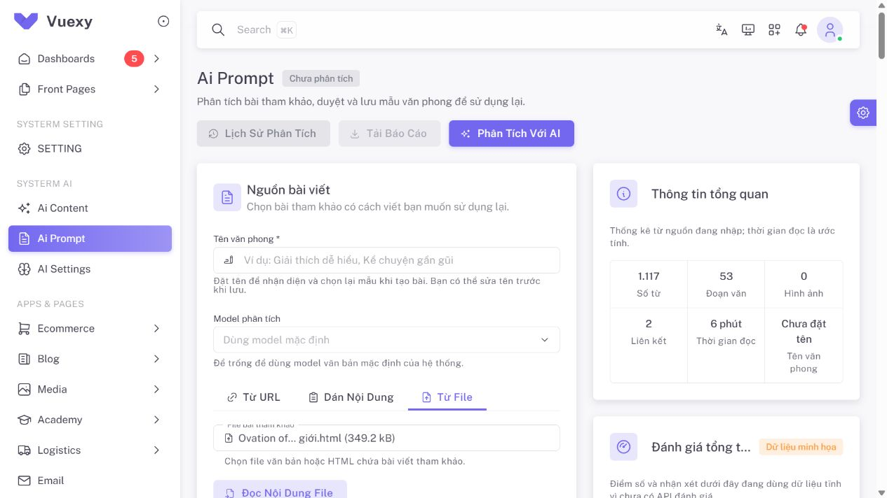

# QA vùng nội dung HTML trong Ai Prompt — 2026-10-04

## Lỗi được tái hiện

File người dùng: `C:/Users/phamc/OneDrive/Máy tính/Ovation of the Seas - Siêu du thuyền thông minh nhất thế giới.html` (349247 byte).

Bài nằm trong `div#article-content` bên trong form của website. Phần bản quyền nằm trong `div.footer > div.copyright > div.container > section`. Bộ lọc cũ chỉ xét `article/main/section`, không nhận ra div thân bài và không loại div footer. Kết quả tái hiện trước sửa: **303 ký tự**, có `GPDKKD`, không có nội dung Royal Caribbean.

## Cách sửa

`ArticleSourceExtractor` dùng chung cho preview và tạo bài:

- Ưu tiên `itemprop="articleBody"` hoặc class/id dạng article/entry/post/story/news-content/body; hỗ trợ dấu nối và gạch dưới.
- Fallback xét article/main/section và div có prose/code/table; lượng text ngoài link và số đoạn prose tăng điểm, link làm giảm điểm. Container rỗng/NBSP không được chọn.
- Loại wrapper footer/copyright/sidebar/navigation/site-header và các role chrome ngoài thân bài. Giữ đoạn nói về copyright ở bên trong vùng bài; không lọc bằng từ khóa xuất hiện trong câu.
- Giữ sanitizer, code whitespace, form content và snapshot contract hiện có. Không hardcode host Startravel, thêm endpoint hoặc gọi AI để đọc file.

Đây là nhận diện heuristic theo DOM, không bảo đảm đúng mọi layout. Preview cho người dùng kiểm tra/sửa văn bản trước phân tích. Chọn CSS selector/vùng DOM thủ công hoặc cấu hình selector riêng từng website là hướng mở rộng, chưa có trong đợt sửa này.

## Kiểm chứng

| Kiểm tra | Kết quả |
| --- | --- |
| Unit extractor/import/pipeline | **38 test / 242 assertions đạt**, gồm 7 test extractor mới |
| Toàn `AiTask2RunApiTest` | **14 test / 75 assertions đạt**, gồm upload HTML qua API preview |
| Pint scoped ba file PHP | **Đạt** |
| File thật chạy qua extractor sau sửa | **5449 ký tự** khi strip tags; có đầu/cuối bài, không có `GPDKKD`; 11 ảnh nằm trong vùng bài |
| Upload file thật qua Ai Prompt localhost | **1117 từ**, textarea 5577 ký tự sau chuyển HTML thành text/giữ xuống dòng |

Browser xác nhận `Royal Caribbean`, mục `1. Đài quan sát` và mục `8. Hệ thống nhà hàng` đều có; đoạn footer `GPDKKD` không có. Ảnh nguồn được snapshot tách vào metadata `source_images`, không đưa vào văn bản gửi phân tích. Không bấm chạy AI hoặc lưu profile; preview không tạo run/job. Test Feature dùng SQLite cô lập và chặn network thật. Không sửa Vue/JS hoặc chạy lại frontend build trong đợt chỉ sửa backend này.

