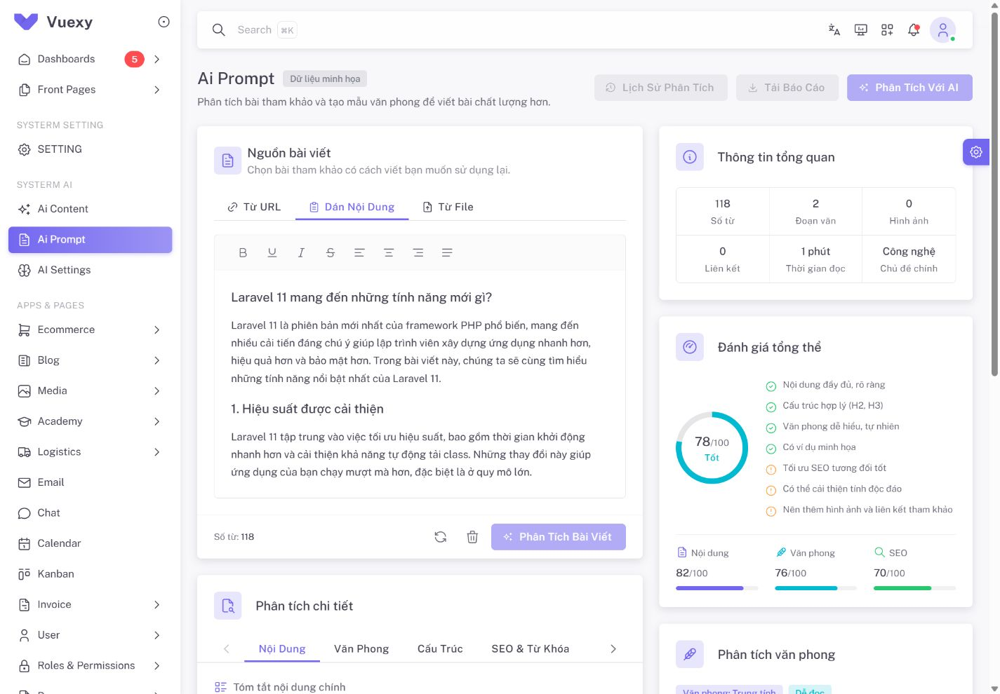

# Ai Prompt — custom giao diện ngày 2026-10-04

Giữ bố cục hai cột và các khối nguồn/phân tích/tổng quan/văn phong/prompt từ giao diện người dùng cung cấp. Áp dụng card, typography, icon Tabler và màu theme của project. Route giữ quyền `ai_settings.manage`.

## Phạm vi

- `resources/js/pages/ai/prompt/index.vue`: header và ghép các component.
- `resources/js/views/ai/prompt/AiPromptSourceCard.vue`: tabs nguồn, editor và thao tác nguồn.
- `resources/js/views/ai/prompt/AiPromptAnalysisCard.vue`: các panel phân tích chi tiết.
- `resources/js/views/ai/prompt/AiPromptInsights.vue`: chỉ số, nhận xét và prompt.
- `resources/js/views/ai/prompt/promptPreview.js`: dữ liệu minh họa và thống kê nguồn.

Phân tích AI, lịch sử, báo cáo, lấy URL/đọc file và lưu mẫu chưa nối API. Các nút tương ứng được vô hiệu hóa; nhận xét/điểm số có nhãn dữ liệu minh họa. Không gọi model trong đợt kiểm tra này.

Ai Prompt tái sử dụng Tiptap có sẵn của project. TinyMCE Cloud key hiện tại bị khóa, đã được ghi nhận từ các đợt QA trước; cấu hình và editor của Post không thay đổi.

## Kiểm chứng

- Scoped ESLint: đạt.
- Production build: đạt; cảnh báo asset `section-title-icon.png` có từ trước.
- Browser local: đăng nhập account development, trang hiển thị đúng ở desktop 1440 px và mobile 390 px.
- Light/dark: card, chữ, border và editor theo theme. Khôi phục theme System sau kiểm tra.
- Mobile: chiều rộng nội dung bằng viewport, không tràn ngang.
- Các tab URL/file/nội dung và tab Văn phong hiển thị panel tương ứng.
- Nhập câu 10 từ: bộ đếm cập nhật thành 10; xóa về 0 và khôi phục bài mẫu về 118 từ.
- Sao chép prompt: có thông báo thành công.

