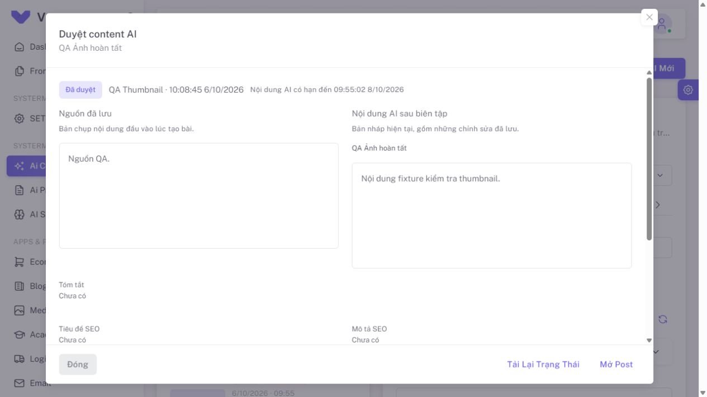

# QA dialog nguồn và lịch sử duyệt — 2026-10-06

**Báo cáo lịch sử, đã được thay thế:** người dùng phản hồi cách tắt transition
không đúng với project. Hiệu ứng mặc định đã được khôi phục và kiểm tra lại tại
[QA hiệu ứng dialog, FIX 1 mục 12.39](../AI_REVIEW_DIALOG_EFFECT_2026-10-06/README.md).
Các kết quả và artifacts bên dưới mô tả giải pháp cũ tại 12.38.

## Vấn đề và thay đổi

Nền tối xuất hiện ngay do CSS scrim của Vuexy, còn dialog dùng transition mở.
Overlay tải dữ liệu bên trong card thêm một lớp tối. Review dialog đã chuyển
sang hiện khung ngay và tiến trình inline; nút X/Đóng dùng được khi GET đang chờ.
Hai cột giữ tiêu đề, có trạng thái tải riêng và chú thích về dữ liệu đã lưu.

## Ý nghĩa dữ liệu

| Cột/thông tin | Nơi lưu | Ý nghĩa |
| --- | --- | --- |
| Nguồn đã lưu | `ai_imports.source_meta_json.article_source.content_html` | Snapshot nội dung đầu vào sau extract/làm sạch, không đọc lại URL khi mở dialog |
| Nguồn fallback | `ai_imports.source_text` | Văn bản/yêu cầu đầu vào khi không có snapshot |
| Nội dung AI sau biên tập | `ai_imports.result_json.draft.content_html` | Bản nháp mới nhất, gồm kết quả AI và chỉnh sửa đã lưu; `content` là alias |
| Trạng thái duyệt hiện tại | `ai_imports.source_meta_json.editorial` | Quyết định/người duyệt/thời điểm/lý do |
| Lịch sử sửa/duyệt/từ chối | `activity_log` | Log `ai-content`, `properties.candidate_id`; sự kiện sửa chỉ ghi field đã thay đổi |
| Bài sau duyệt | `posts.content` | Nội dung được áp dụng, Post status draft |

`ai_imports` vẫn chịu thời hạn/cleanup hiện tại; bảng `ai_content_drafts` dài hạn
đang tạm hoãn. Dialog không hiển thị các chỉnh sửa chưa bấm lưu trong editor.

## Kiểm chứng mới

- `aiContentReview.test.js`, `aiContentReviewDialog.test.js`,
  `appDialogLayout.test.js`: **23 tests / 3 files** đạt.
- ESLint, Stylelint scoped và `git diff --check`: đạt.
- Production build: đạt, **1 phút 23 giây**.
- VDialog/VOverlay thật trong component test: khung/loading, một scrim, nút X
  không khóa khi đọc, after-leave và DOM được dọn khi đóng.
- Browser với Laravel/Vue thật, DB/account fixture riêng tại localhost:8001,
  viewport mặc định **1280 × 720**. [open-state.json](open-state.json) ghi ngay
  sau mở: loading=true, card visible, opacity=1, một scrim, nút X enabled.
  Đóng bằng X rồi mở bài khác nhận đúng title; đóng bằng footer về danh sách.

Lệnh tests:

```powershell
npm run test:run -- tests/frontend/aiContentReview.test.js tests/frontend/aiContentReviewDialog.test.js tests/frontend/appDialogLayout.test.js
npm run build
git diff --check
```

Đợt này không gọi generation AI, không migrate DB ứng dụng hoặc sửa `.env`.
Full suites ở FIX 1 mục 12.37 là lượt trước. Tab/server QA tạm được đóng sau QA;
Vite/PHP do người dùng mở được giữ nguyên. DB/media fixture đã có từ đợt thumbnail
còn trong thư mục riêng theo ghi chú cleanup tại báo cáo thumbnail.

## Bằng chứng giao diện


