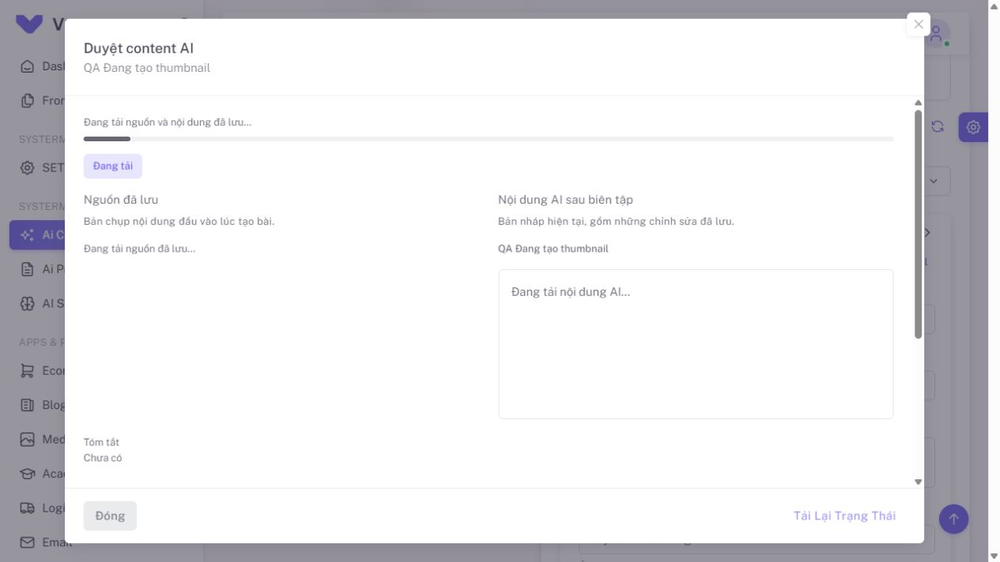
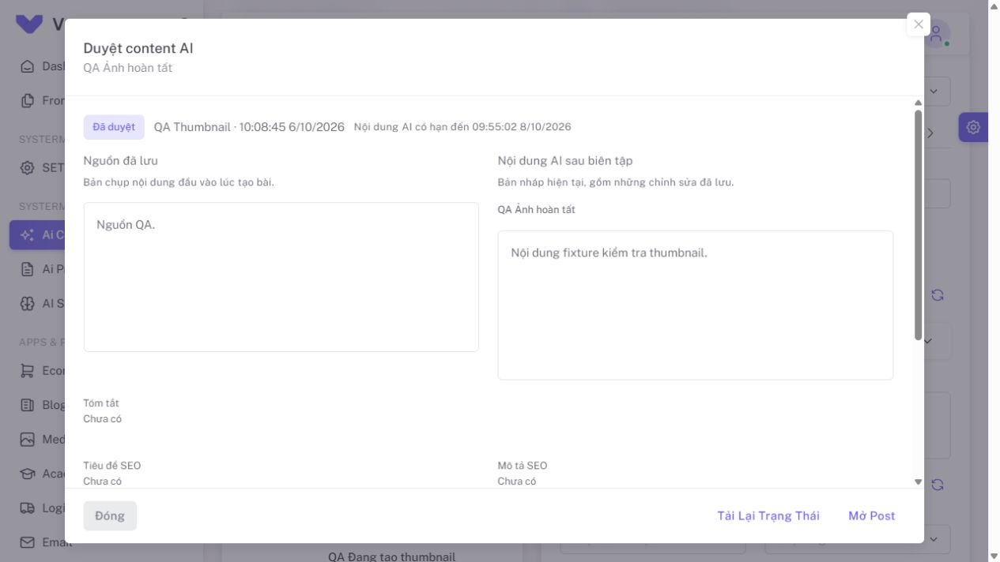
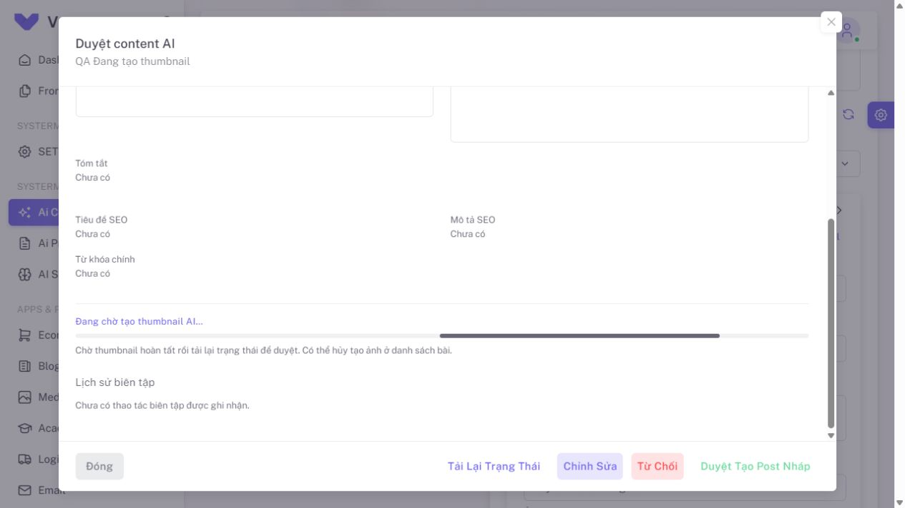

# QA hiệu ứng dialog nguồn và lịch sử duyệt — 2026-10-06

## Phạm vi

Người dùng yêu cầu dialog mở đúng hiệu ứng của project. Giải pháp tắt transition
tại [mốc 12.38](../AI_REVIEW_DIALOG_2026-10-06/README.md) đã được thay thế.

- Dùng `VDialog scrollable` với transition mặc định và `AppDialogLayout` hiện có.
- Khôi phục fade của scrim riêng cho review dialog; Vuexy đang ép opacity nền
  bằng `1 !important`. Nền có cùng easing/thời lượng mở 225 ms, đóng 125 ms với
  khung dialog khi không bật chế độ giảm chuyển động.
- GET bắt đầu ngay khi mở. Prop `active` của `AiContentComparison` trì hoãn
  parse/render văn bản dài đến `after-enter`, giữ văn bản trong leave rồi dọn.
- Tiến trình tải inline, không thêm lớp tối lên card. Giữ header/footer và nút X.

## Kiểm chứng

| Kiểm tra | Kết quả |
| --- | --- |
| Ba file frontend liên quan | 24 tests đạt: review 9, dialog/comparison 11, layout 4 |
| ESLint/Stylelint scoped | Đạt |
| Production build | Đạt, 1 phút 7 giây |
| Browser thực | Laravel/Vue tại localhost:8001, DB/account fixture riêng |
| Mở, đóng, mở lại | Ba candidate, đúng title và dữ liệu sau khi đổi bài |

Component test dùng VDialog/VOverlay thật và lifecycle Transition thật:
dữ liệu trả sớm vẫn chưa xuất hiện trong enter; văn bản xuất hiện sau enter,
còn nguyên trong leave và DOM được dọn khi `afterLeave` phát ra.

Lệnh kiểm tra:

```powershell
npm run test:run -- tests/frontend/aiContentReview.test.js tests/frontend/aiContentReviewDialog.test.js tests/frontend/appDialogLayout.test.js
npm run build
git diff --check
```

Đợt này không thay đổi PHP, không chạy lại full backend/frontend suites.
Kết quả đầy đủ tại FIX 1 mục 12.37 là bằng chứng lịch sử của thumbnail AI.

## Bằng chứng chuyển động và bố cục

- [opening-opacity.json](opening-opacity.json): lượt lấy mẫu ngắn đồng thời hai
  opacity khi mở, cùng **0 → 0.852497 → 1**.
- [opening-effect.json](opening-effect.json): lớp enter mặc định, scale 0.9 → 1,
  text nguồn chưa render trong enter và xuất hiện sau đó.
- [closing-effect.json](closing-effect.json): lớp leave mặc định, nền/khung cùng
  **1 → 0.933624 → 0.562011**, text giữ đến khi dialog bị dọn.
- [reopening-effect.json](reopening-effect.json): bài thứ hai nhận đúng title,
  enter chạy lại và trạng thái render text reset.
- [ready-state.json](ready-state.json): body đã cuộn 285 px, header vẫn ở
  24–122 px và footer ở 626–696 px; một scrim, nút X không khóa.

Các mốc `ms` là thời điểm công cụ lấy mẫu, gồm chi phí đọc giao diện. Các property
trong lượt lấy mẫu dài được đọc tuần tự; dùng lượt opacity ngắn để đối chiếu nền
và khung. Đây không phải phép đo latency hoặc tốc độ khung hình của ứng dụng.
Không đặt viewport override; dùng kích thước mặc định của tab kiểm tra.

### Khung tải khi mở



### Nguồn và nội dung sau khi mở



### Lịch sử ở cuối body, header/footer vẫn hiện



## Môi trường và cleanup

Tái sử dụng SQLite/account/media fixture riêng từ đợt thumbnail. Không chạy queue
worker, gọi provider AI thật, migrate DB ứng dụng hoặc sửa `.env`/`public/hot`.
Tab/server PHP QA tạm đã đóng; giữ Vite/PHP mà người dùng đã mở.
Fixture/log/media vẫn nằm trong thư mục riêng theo ghi chú cleanup ở
[báo cáo thumbnail](../AI_THUMBNAIL_2026-10-06/README.md).
