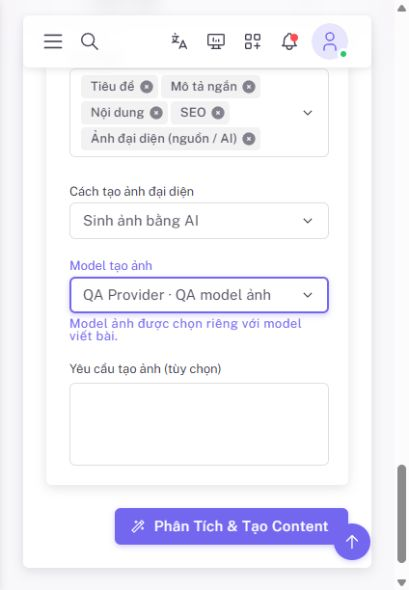

# QA — Thumbnail sinh bằng AI — 2026-10-06

## Phạm vi hoàn thành

FIX 1 mục 12.37: thumbnail AI trong AI Content → Post đã `DONE`. Toàn FIX 1 vẫn
`IN PROGRESS`; Realtime/VPS và Settings ngoài AI thuộc các đợt tiếp theo.

`DONE` là phạm vi kỹ thuật sinh thumbnail của Post tại AI Content và gắn
vào Featured Image của Post nháp khi duyệt. Không nghiệm thu trong mốc này luồng
tạo ảnh thủ công đã có ở Add/Edit Post, hoặc luồng phân tích nội dung Post để
sinh thumbnail phù hợp (chưa triển khai, tạm hoãn ngày 2026-10-06).

Quy ước: **ảnh trong content** minh họa cho một đoạn/phần bên trong bài;
**thumbnail của Post** đại diện cho toàn bộ Post ở trường Thumbnail/Featured Image.

- Chọn nguồn/AI, model ảnh độc lập model nội dung, prompt ảnh tùy chọn.
- Tạo ảnh sau khi bài ready, lưu MediaAsset canonical và tiếp tục theo dõi child.
- Preview, tiến trình/lỗi, kiểm tra lại, thử lại/hủy riêng ảnh.
- Regenerate riêng thumbnail giữ nội dung; regenerate field khác giữ ảnh và lineage.
- Giữ edit mới nhất, chặn version cũ/kết quả trễ/retry trùng, khóa worker theo run.
- Duyệt thành Post draft cùng media usage và provenance đúng provider/model ảnh.

## Kiểm thử tự động cuối

| Kiểm tra | Kết quả |
| --- | --- |
| Toàn bộ backend | **390 tests / 2727 assertions**, 2 phút 7,659 giây |
| Toàn bộ frontend | **46 files / 333 tests**, 23,34 giây |
| Pint | Đạt trên các PHP file trong phạm vi thay đổi |
| ESLint / Stylelint | Đạt trên các JS/Vue/test file trong phạm vi thay đổi |
| Production build | Đạt, **2 phút 6 giây** |
| `git diff --check` | Đạt |

`AiGeneratedThumbnailTest` kiểm create → image HTTP fake/upload → summary/review
→ approve → Post/usage/provenance/cleanup; lỗi ảnh/retry trùng; edit và version;
cancel/reject trong lúc chờ; response trễ; regenerate riêng/toàn bộ và model
override; quyền/model không khả dụng; queue delivery được release khi khóa bận.
Regression frontend kiểm catalog/defaults, các kiểu nguồn, payload, polling,
retry/cancel và review khi ảnh pending.

Lệnh kiểm tra chính tại thư mục project:

```powershell
php -d xdebug.mode=off vendor/bin/phpunit --no-progress
npm run test:run
npm run build
git diff --check
```

GD đã bật trong PHP CLI hiện tại; không sửa php.ini. Warning component stub ở
frontend tests và asset `section-title` khi build có từ trước; không có test/build
failure. Kết quả trên là các lượt chạy mới của đợt này.

## Browser QA với dữ liệu riêng

Laravel/Vue thật trên `http://localhost:8001/admin/ai/content`; SQLite, tài khoản,
provider/model và media fixture riêng. In-app browser dùng viewport mặc định
**409 × 590**, không đặt lại kích thước. Không migrate DB đang dùng hoặc sửa `.env`.

| Tình huống | Đã xác nhận |
| --- | --- |
| Nguồn prompt, mode AI | Lựa chọn đầu ra thumbnail được bật, model `qa-text` và `qa-image` tách biệt |
| Ảnh pending | Có tiến trình; review chặn duyệt, vẫn cho sửa/từ chối |
| Ảnh failed → retry | Child trở lại queued; list vẫn có ba bản bài |
| Hủy ảnh retry | Child cancelled; nội dung bài giữ nguyên |
| Ảnh ready → duyệt | Post #1 có status draft, một thumbnail usage, provenance `qa-thumbnail / qa-image` |

Các trạng thái dùng fixture có nhãn. Không chạy queue worker; một bản pending
chạm giới hạn polling và hiện thông báo tạm dừng theo thiết kế. Backend tests
kiểm HTTP image adapter bằng response giả lập; **không gọi dịch vụ AI trả phí và
chưa nghiệm thu chất lượng ảnh/model thật**.

Ảnh fixture là dữ liệu kiểm tra, không đại diện cho output AI thật. Sau QA đã
đóng tab/server tạm và phục hồi `public/hot` đúng hash ban đầu; Vite do người dùng
chạy từ PhpStorm được giữ nguyên.

Thao tác xóa DB/file/media fixture bị cơ chế xét duyệt tự động từ chối với thông
báo `blocked by policy`. Dữ liệu còn ở `storage/app/qa-thumbnail-20261006/` (ignored)
và ảnh `storage/app/public/media/990061/qa-thumbnail.png`; không nối với DB ứng dụng.
Các log test/build cuối còn trong thư mục QA này.

## Bằng chứng

- [Lựa chọn thumbnail và model ảnh](model-select.jpg).
- [Trạng thái pending trên mobile](mobile-pending.jpg).
- [Duyệt thành Post draft](approval.jpg).
- [Đối chiếu DB fixture](browser-db.json): Post draft, usage, image states và provenance.



## Tài liệu đã cập nhật

- [FIX 1](../../fix_1.md), mục 12.37.
- [PLAN](../../PLAN.md).
- [API pipeline](../../AI_ARTICLE_PIPELINE_API.md).
- [Cấu trúc project](../../PROJECT_STRUCTURE.md).
- [Inventory](../../PROJECT_INVENTORY.md).
