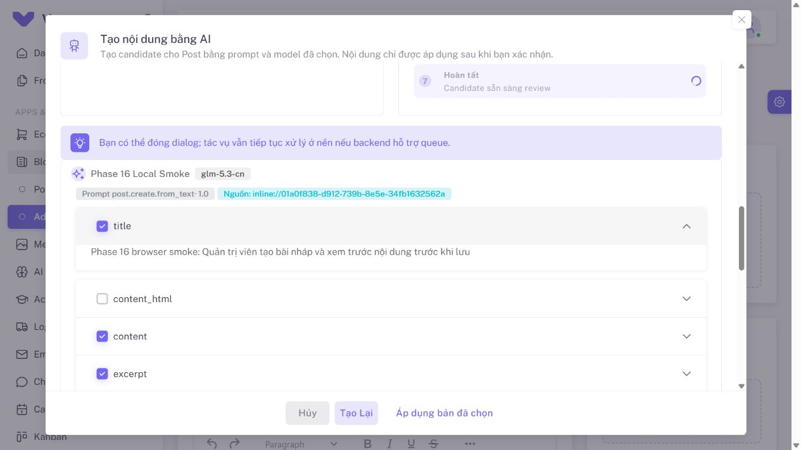

# Phase 16 — nghiệm thu local ngày 01-10-2026

Thực hiện mục 2 (provider/key thật) và mục 3 (runtime/browser/checks). Người dùng
chọn kiểm thử local trước. `AiDefaultsPanel` được dành cho System Settings trong
đợt triển khai sau; component và API settings đã có, chưa gắn vào AI Providers.

## Kết quả

| Kiểm tra | Kết quả | Bằng chứng/phạm vi |
| --- | --- | --- |
| Gateway với key thật | Đạt | API Mua, driver `openai-compatible`, host `api.apiforcode.com`; catalog/test HTTP 200. |
| Sync `/models` thật | Đạt | API sync trên connection tạm nhận 7 model; giữ capability do admin khai báo. |
| Text/structured output thật | Đạt | `glm-5.3-cn`; database worker hoàn tất hai run trong khoảng 21s và 10s; candidate `ready`, progress 100. |
| Apply API và provenance | Đạt | Bài nháp có audit cho title/content/excerpt/seo, provider/model, prompt `post.create.from_text` v1.0 và value hash. |
| Browser → candidate → Apply → Save as Draft | Đạt | UI gọi Laravel thật, chọn model override, polling hoàn tất, preview tiêu đề và lưu nháp; database xác nhận bốn nhóm provenance. |
| Image provider thật | Chưa đạt | `glm-5.3-flash-cn` gọi `images/generations` trả `AI_PROVIDER_HTTP_403`; không tạo asset và không làm mất text candidate. HTTP 403 chưa xác định riêng được nguyên nhân quyền key, model hay endpoint. |
| Storage/conversions với fixture | Đạt | Ảnh PNG fixture qua `AiImageGenerationService`/uploader và database worker; featured WebP 1200×675, OG WebP 1200×630, status ready. Đây không phải ảnh được provider tạo thật. |
| Public preview/download/attach | Đạt | Metadata/download API HTTP 200, attach HTTP 201; trình duyệt tải được featured WebP và xác nhận natural size 1200×675. |
| Hủy/terminal job | Đạt | API cancel HTTP 200; worker giữ status cancelled và không gọi provider. |
| Quota local | Đạt | Đặt quota 0 chỉ trong tiến trình thử; request mới trả HTTP 429. Settings toàn hệ thống không đổi. |
| Cleanup asset | Đạt | Xóa run giữ asset có Post usage; orphan bị xóa file và soft-delete. Conversion job còn trong queue được discard sau cleanup, không fail/retry. |
| Timeout | Đạt bằng fixture | HTTP connection exception được chuẩn hóa thành `AI_PROVIDER_TIMEOUT`, POST không tự retry. Không cố tạo timeout bằng request trả phí thật. |
| Secret boundary | Đạt trong phạm vi kiểm tra | Không tìm thấy key gateway trong response API đã kiểm tra, các log Laravel hiện có hoặc file Git tracked. Key lấy từ encrypted DB, không gửi trực tiếp từ browser. |
| Provider chính thức | Chưa kiểm thử thật | Local không có key OpenAI/Gemini chính thức. Adapter đã được bao phủ bởi HTTP fake. |
| Staging | Chưa chạy | Không có target staging; người dùng chọn local trước. |

Trong lần nghiệm thu ban đầu, resolver yêu cầu cả `text_generation` và
`structured_output`; đợt thử dùng connection tạm khai báo đủ hai capabilities.
Đợt sửa dialog sau đó đã bỏ điều kiện ẩn này: model content chỉ cần
`text_generation`, JSON mode tùy chọn và response vẫn được validate. Provider
gốc đã chạy thật tới ready/100%; xem [báo cáo bổ sung](POST_AI_DIALOG_FIX_2026-10-02.md).
Không tự sửa capabilities hoặc default/fallback của người dùng.

## Lỗi đã sửa khi nghiệm thu

1. Conversion job chứa Media model đã bị cleanup có thể fail ngay lúc Laravel
   khôi phục payload. Job hiện cho phép discard missing model; chế độ retry bằng
   ID cũng bỏ qua media đã xóa. Hai regression tests xác minh trực tiếp và qua
   serialized database queue.
2. Wrapper giữa `VDialog` và `VCard` làm CSS scrollable của Vuetify không áp dụng.
   Card hiện là child trực tiếp, giữ `id="view-moi"`; phần nội dung cuộn được,
   header/footer và nút Apply luôn truy cập được.
3. Post dialog gửi raw output keys như `content_html`, `seo_title` vào lineage,
   trong khi Post API chỉ chấp nhận nhóm field. Apply hiện tạo lineage từ payload
   thực sự được áp dụng, deduplicate `content`/`seo`/`taxonomy` và bỏ thumbnail chưa
   có asset. Hai frontend tests kiểm tra Apply đầy đủ và Apply một field SEO.
4. ESLint quét bundle nén trong `public/build` và MSW được sinh tự động. Cấu hình
   hiện bỏ qua hai nguồn này; lint vẫn kiểm tra toàn bộ mã nguồn dự án.

## Kiểm tra cuối

| Lệnh | Kết quả |
| --- | --- |
| `php artisan test --no-coverage` | **144 passed, 750 assertions** |
| `npm run test:run` | **23 files, 95 tests passed** |
| `npx eslint . -c .eslintrc.cjs --ext .ts,.js,.cjs,.vue,.tsx,.jsx` | **991 files, 0 errors**; 669 warnings hiện có. Không chạy `--fix` toàn repo. |
| `npm run build` | **Thành công**, bản cuối khoảng 1m01s; còn cảnh báo bundle size từ template. |

AI Settings trên browser: bốn tab đều cao 640px; capability column và edit model
hiển thị; test `glm-5.3-cn` có tick success, giữ bộ lọc và không có console error
trên trang settings. Test frontend khóa cả success/error/retry không reload catalog.

Ngoài luồng AI, TinyMCE ở local báo key validation thất bại và chuyển editor sang
read-only. Apply nội dung bằng chương trình và Save as Draft đã đạt; thao tác sửa
tay trong editor chưa được nghiệm thu. Không thay key TinyMCE trong phạm vi này.

## Cô lập và dọn dữ liệu

Runtime dùng server tạm tại `127.0.0.1:8001`, queue riêng `phase16-smoke`, và GD
được bật bằng `php -d extension=gd` cho từng tiến trình. Không sửa `php.ini` hệ thống.
Các 9 jobs có sẵn trong queue `default` không được worker thử xử lý.

Tài khoản/token, connection/models, Post/provenance, media/file fixture, job và
failed-job phát sinh được dọn sau kiểm thử. File declarations do build sinh lại
được khôi phục về trạng thái trước đợt thử, giữ thay đổi người dùng đã có.

## Các phần còn chờ

- Key OpenAI/Gemini chính thức để nghiệm thu onboarding/test connection thật.
- Key/model/endpoint được phép tạo ảnh; request hiện tại trả HTTP 403.
- Staging với worker, storage và quyền truy cập phù hợp để nghiệm thu text/image.
- `AiDefaultsPanel` sẽ được đặt tại System Settings.
