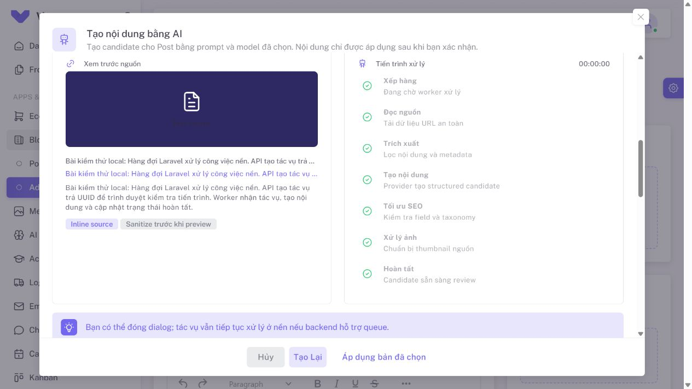

# Sửa provider/model và tiến trình dialog Post AI

Người dùng báo provider/model không tải được, API status với UUID gọi liên tục
nhưng tiến trình không thay đổi. Kiểm tra trên local `127.0.0.1:8000`.

## Nguyên nhân và thay đổi

1. `AiModel::usableFor(Text)` yêu cầu cả `text_generation` và `structured_output`.
   Hai model content trên API Mua chỉ có `text_generation`, nên registry và
   resolver loại cả provider khỏi options. Model content giờ dùng được với
   `text_generation`; image-only, unknown, disabled/unavailable vẫn bị lọc.
   JSON mode chỉ bật nếu connection khai báo `structured_output`; prompt yêu cầu
   JSON phẳng với kiểu field rõ ràng và backend vẫn kiểm tra output.
2. Local dùng queue database nhưng chỉ chạy Laravel server và Vite, chưa có
   worker. Các job mới vẫn queued/0%, GET status không thực thi pipeline. Worker
   `default` đã được khởi động để xử lý các job đã yêu cầu và job mới.
3. Post dialog ưu tiên `job_id` trước `session_id`, tránh poll candidate cha khi
   regenerate tạo child. Poll tuần tự, mỗi 3 giây khi queued và 1,2 giây khi xử lý;
   dừng khi terminal, hiện lỗi provider từ backend. Chờ queue 60 giây hoặc kiểm
   tra xử lý 5 phút thì tạm dừng tự động, cho phép kiểm tra lại cùng UUID hoặc hủy.
   Tạm dừng ở client không tự đánh dấu job server là failed.
4. Tải options ngay cả khi mount với dialog đã mở; hiện loading và xóa model cũ
   khi đổi provider. Generation guards ở dialog/store ngăn response đến muộn
   ghi đè session/options mới. Mốc hoàn tất hiển thị done và elapsed time cập nhật.
5. Một request thật trả `AI_PROVIDER_SCHEMA`. Prompt đã nêu contract
   kiểu dữ liệu; null được coi là field bỏ qua để giữ source fallback. Các kiểu
   sai khác vẫn bị từ chối và lỗi chỉ rõ field.

## Nghiệm thu

- Browser hiển thị provider API Mua, model `glm-5.3-cn` và `qwen-3.8-flash-cn`.
  Image-only và model chưa khai báo capability không xuất hiện trong selector content.
- Run text thật qua provider gốc `glm-5.3-cn`, không thêm capability hoặc sửa
  default của người dùng: retry sau khi làm rõ prompt hoàn tất `ready`, progress
  100%, có candidate. Request đầu trả `AI_PROVIDER_SCHEMA` và dialog đã hiển thị
  lỗi, dừng polling. Không lưu hoặc publish Post từ đợt debug này.
  Mở lại cùng request nhận candidate ready qua idempotency, toàn bộ bước có tick
  và nút Apply hiển thị; xem ảnh dưới đây.
- Backend: **146 tests, 769 assertions**. Regression xác minh text-only model
  qua options, resolver, snapshot, queue/job và malformed JSON; kiểm tra null
  optional field nhưng vẫn chặn text field kiểu object.
- Frontend: **25 files, 104 tests**. Bao phủ mở dialog, đổi provider, child UUID,
  terminal errors, giới hạn queue/processing, resume cùng run, đóng/mở lại và
  response races trong Pinia.
- ESLint các file frontend sửa: **0 errors**. Production build thành công.
- GD chỉ bật cho tiến trình worker, không sửa `php.ini`; file declaration sinh
  bởi build được khôi phục, giữ thay đổi người dùng đã có.



## Chạy local

Server/Vite cần chạy cùng queue worker. Nếu worker local đã tắt hoặc máy khởi
động lại, chạy trong thư mục project:

```powershell
php -d extension=gd artisan queue:work --queue=default --sleep=1 --tries=3 --timeout=180
```

Worker được bật trong đợt sửa này chạy nền; log tại `storage/logs/local-ai-worker.log`.
Khi sửa code backend đang được worker giữ trong memory, dùng `php artisan queue:restart`
rồi khởi động lại worker. Không chuyển queue sang sync hoặc chạy provider trong GET status.

Staging và quyền tạo ảnh thật vẫn còn chờ như báo cáo Phase 16. Một request dài
có thể gặp `AI_PROVIDER_TIMEOUT` theo timeout trong snapshot; UI hiện lỗi này và
cho phép retry chủ động. Không retry tự động POST đã timeout.
