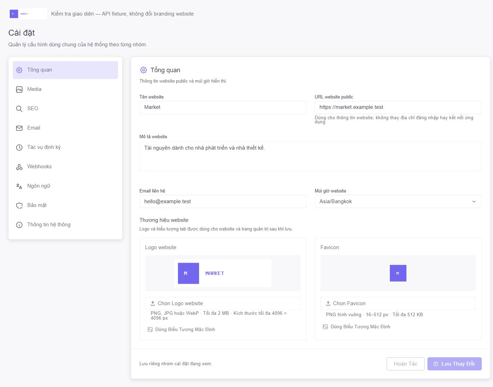
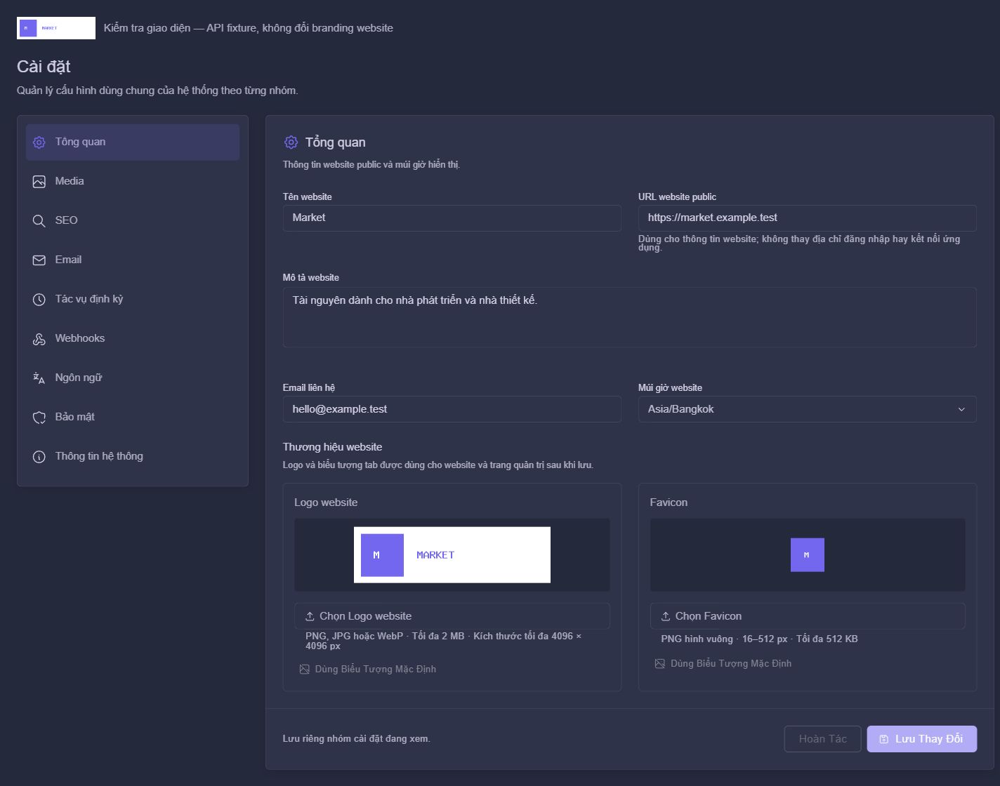
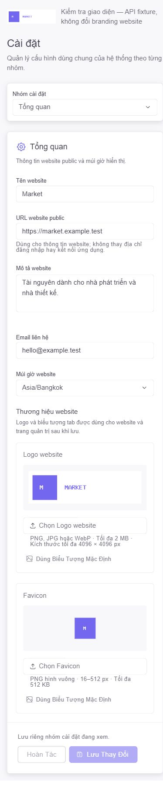

# QA Settings logo/favicon — 2026-10-06

## Phạm vi đã hoàn tất

- Hai upload/preview trong tab Tổng quan, Save cùng version/site draft, Hoàn tác,
  gỡ để dùng mặc định, lỗi/409 giữ file và quyền read-only.
- Backend kiểm type/bytes/size/ratio/dimensions, path UUID, quyền/version,
  persistence/reload/audit, cleanup sau commit và rollback khi audit thất bại.
- Logo/favicon Blade public/admin và logo theme SPA dùng dữ liệu đã lưu.
- Migration hai property đã chạy riêng trên DB development; không thay branding
  hoặc cấu hình website đã lưu. GET admin/login thật trả 200 và bootstrap hiện diện.

## Kiểm chứng tự động

```powershell
php -d extension=gd -d xdebug.mode=off vendor/bin/phpunit tests/Feature/SiteBrandingTest.php tests/Feature/ProjectSettingsApiTest.php tests/Feature/SpatieSettingsMigrationTest.php --no-progress
npx vitest run tests/frontend/settingsBranding.test.js tests/frontend/settings.test.js tests/frontend/settingsLocales.test.js
```

- Backend: **15 tests / 135 assertions**, SQLite/storage cô lập. GD chỉ bật cho
  tiến trình tạo ảnh test, không đổi php.ini.
- Frontend: **3 files / 12 tests**; panel/file inputs và AppBrandLogo dùng Vuetify/Vue
  thật. Kiểm multipart/method spoof/readonly fields, không upload trước Save,
  dirty/reset/blob release, 422/409/busy/read-only, áp dụng favicon sau save.
- ESLint, Stylelint và Pint scoped: đạt. Production build: **1 phút 5 giây**.
- Logs local: `.zcode/branding-backend-tests.log`, `branding-frontend-tests.log`,
  `branding-build.log`. Không gộp với kết quả toàn suite ở những đợt trước.

## Browser

Page Settings/panel/theme thật qua fixture `.zcode/branding-preview.html`, API mock
ghi vào sessionStorage của tab QA, không thay database/logo/favicon development.
Ảnh PNG QA có nhãn `MARKET`, không phải logo được chủ dự án chọn.

- Chọn hai PNG bằng file inputs: trước Save có hai blob preview và badge Chưa lưu;
  logo live/favicon chưa đổi. Save: notice thành công, badge mất, logo live/favicon
  đổi và reload giữ ảnh fixture. Control file input native được dùng cho chooser.
- Desktop 1440 px sáng/tối: không tràn ngang; mobile 390 px: không tràn ngang,
  logo/favicon cards xếp dọc. Viewport/tab/server Vite QA đã dọn.
- Feature tests kiểm upload và persistence qua Laravel HTTP thật với storage fake;
  browser này kiểm UI/mock API, không phải smoke upload trên server production.





Realtime/VPS được chủ dự án bỏ qua trong đợt này. Webhooks, run history/heartbeat,
GA/GSC/2FA/CAPTCHA và SMTP/VPS vẫn là backlog; không đánh dấu toàn FIX 1 hoàn tất.
